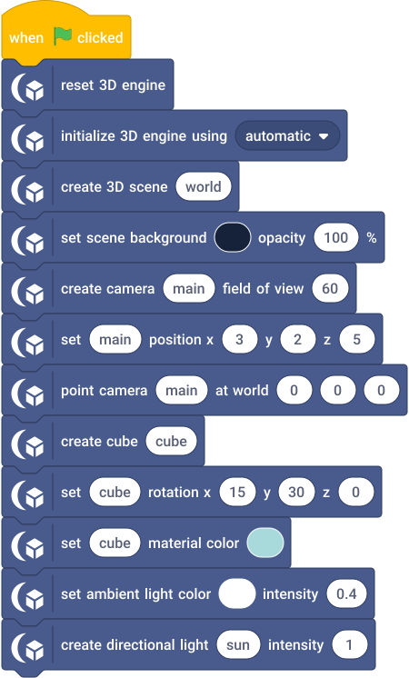

# Getting started

## Load Eclipse 3D

Use TurboWarp Desktop or the TurboWarp web editor with unsandboxed custom-extension support and WebGL 2.

### From a release download

Download `eclipse3d.js` from a GitHub Release. The smaller `eclipse3d.min.js` is an alternative with the same API; choose one bundle.

In **Add Extension → Custom Extension → File**, select the downloaded JS file. You do not need Node.js, the source repository, a `dist/` folder, or a source map to load it.

Eclipse 3D must run unsandboxed; enable **Run extension without sandbox** where the host shows that option. If loaded sandboxed, the extension refuses to start and reports that it must run without the extension sandbox. The loaded category is **Eclipse 3D**. The internal extension ID remains `turbo3d` for compatibility with existing projects.

### From a source checkout

Clone or download the source repository, install Node.js 22 or later, and run these commands from the repository root:

```sh
npm ci
npm run build
```

The build writes `dist/eclipse3d.js` and its debugging source map, `dist/eclipse3d.js.map`, inside the source checkout. Use **Add Extension → Custom Extension → File** to select that JS file and enable unsandboxed execution as described above. `npm run build:min` writes `dist/eclipse3d.min.js`; either JS bundle provides the same API. Source modules, `node_modules` and source maps are not required by a running project.

For a local URL workflow from that source checkout, run `npm run dev` and load **http://localhost:8000/dist/eclipse3d.js**. Use the exact supported localhost origin; `127.0.0.1` is not an equivalent unsandboxed-origin permission. Hosts restrict which URLs may execute unsandboxed. If the URL path is sandboxed, load the extension through **File** as described above instead of modifying browser security settings. The server landing page is the documentation.

## Your first scene

Open the [Hello 3D project](../examples/hello-3d/README.md), or build this script. Initialize under Green Flag and reset before reusing names. Create the scene and camera, move the camera away from the origin, then create the cube and light it.



The expected result is one pale cyan cube on an indigo background. The camera looks at the origin from `(3, 2, 5)`. The renderer retains that image and responds to edits; there is no need for a forever loop that repeatedly recreates the scene or draws a static cube.

After Stop All, the image remains and simulation is frozen. A clicked block can make a static edit. Click Green Flag to run simulation again. [Lifecycle details](concepts.md#lifecycle) explain the distinction.

## Add a shared material

Create a named material, choose its type, set its base color and assign it to a resource. Multiple objects may share it. Editing the named material changes all its users. Use separate materials when the objects need independent factors.

Unlit ignores lights. Basic-lit uses scene lighting. PBR uses metallic/roughness factors and can receive environment lighting. Start with the [Materials & Lighting example](../examples/materials-lighting/README.md); then use the [material reference](reference/materials-and-textures.md) for depth, blend, texture and PBR controls.

## Load a model or texture

Use **import 3D model file as [MODEL]** to choose a local GLB or self-contained glTF. See [local importing and cancellation](model-import.md).

Load command blocks wait until loading finishes or fails before the script continues. Check the load state and error reporters before creating resources that depend on the asset. Prefer self-contained GLB and embedded textures/sounds for portable examples. URL assets require host fetch permission, reachable dependencies and appropriate CORS behavior.

Model assets are shared; instances have independent transforms and animation state. [Animated Model](../examples/animated-model/README.md) demonstrates the order without network dependencies.

## Package a project

TurboWarp Packager can bake the custom extension and embedded project assets into a standalone HTML export. The end user then needs the exported game, not the repository. Remote project asset URLs are still remote unless you embed or otherwise package them.

The release examples contain their extension source in the SB3 extension URL. Approve that custom extension when the host requests it. They preserve the standard `extensions: ["turbo3d"]` and `extensionURLs.turbo3d` identities. Do not edit SB3 internals to perform the rebrand.

[Compatibility and supported hosts](compatibility.md) · [Next: rendered workflows](workflows.md)
