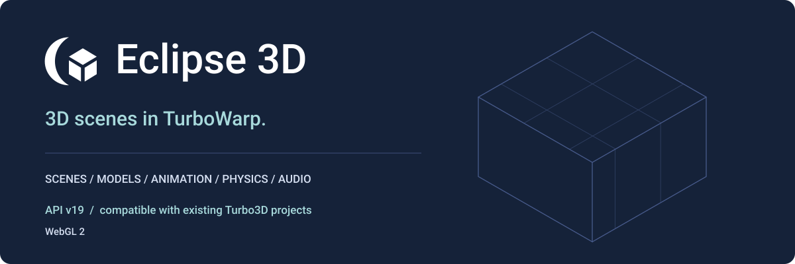

# Eclipse 3D

Build retained 3D scenes inside the TurboWarp stage. Eclipse 3D combines explicit scene/resource control with a WebGL 2 renderer, so scripts can describe a world once and update only what changes.

**Eclipse 3D was formerly Turbo3D. Existing Turbo3D projects remain compatible.** The extension ID remains `turbo3d`; API v19 preserves every existing opcode and serialized argument schema.

[Start a scene](getting-started.md) · [Visual block reference](reference/index.md) · [Runnable examples](../examples/index.md) · [Migration](compatibility.md)

## What you can build

- Scenes with selectable cameras, instanced objects, glTF/GLB models, clip animation and GPU skinning.
- Unlit, basic-lit and metallic/roughness PBR materials, textures, directional/point/spot lighting, directional shadows and environment lighting.
- World-space sprites, billboards, particles, decals, cached text, finite terrain, ray picking and motion tweens.
- Optional gameplay box/sphere physics and positional/global audio, sharing the engine lifecycle.
- Named camera render targets, fused post effects and advanced custom geometry/GLSL materials.

Eclipse 3D requires unsandboxed TurboWarp custom extensions and WebGL 2. It does not run on the Scratch website or in the extension sandbox. The build is one self-contained JavaScript file; no separate engine runtime downloads are required.

## Read in this order

| Task | Guide |
| --- | --- |
| Load the extension and make a cube | [Getting started](getting-started.md) |
| Understand coordinates, ownership and Green Flag/Pause/Stop | [Concepts](concepts.md) |
| Find a block or menu | [Visual reference: all 560 visible blocks](reference/index.md) |
| Learn a complete script | [Rendered workflows](workflows.md) |
| Open a small finished project | [Examples](../examples/index.md) |
| Move an existing project to the new branding | [Compatibility and migration](compatibility.md) |
| Budget and measure rendering | [Performance](performance.md) |
| Diagnose a missing image, asset or sound | [Limitations and troubleshooting](limitations.md) |
| Reproduce docs and examples | [Generation](generation.md) |
| Import a model from disk | [Local model importing](model-import.md) |

## An advanced API with an organized toolbox

The toolbox has 16 major sections and 39 secondary labels, following the same order as the reference. API v19 contains 582 registered executable blocks: 560 visible entries (476 independent plus 84 canonical family blocks) and 22 hidden compatibility aliases. Labels and separators are navigation metadata, not executable blocks.

The API exposes technical controls deliberately. Read the [custom rendering contract](../CUSTOM_RENDERING.md) before writing GLSL and the [physics/audio contract](../PHYSICS_AUDIO.md) before treating gameplay bodies as a full rigid-body solver.

## Architecture

The renderer retains shared geometry, materials, textures, bounds and GPU programs. Dirty edits update retained state; extra camera renders do not advance simulation time. See [architecture](../ARCHITECTURE.md).
