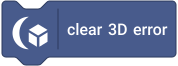

# Metrics, Profiling & Debug

[Reference index](index.md) · [Conventions and lifecycle](../concepts.md)

- [Engine, output and errors](#engine-output-and-errors)
- [Model and geometry resources](#model-and-geometry-resources)
- [Materials and PBR](#materials-and-pbr)
- [Lighting, shadows and environments](#lighting-shadows-and-environments)
- [Animation and skinning](#animation-and-skinning)
- [Sprites, particles, decals and text](#sprites-particles-decals-and-text)
- [Visibility, spatial index and LOD](#visibility-spatial-index-and-lod)
- [Physics and audio](#physics-and-audio)
- [Post processing and targets](#post-processing-and-targets)
- [Custom rendering](#custom-rendering)
- [Raycasting, terrain and tweens](#raycasting-terrain-and-tweens)

## Engine, output and errors

Renderer backend returns the active backend name; FPS and average FPS describe host/update pacing rather than GPU throughput. Draw calls and internal width/height/pixel-count/pixel-ratio describe actual renderer output. The three-draw static baseline and scenario comparisons are historical performance evidence, not a promise for every material/feature combination.

`lastError` is the latest extension diagnostic. Clear it before isolating a new operation, then read it after a failure. Missing-resource typed queries can update this diagnostic, whereas existence probes are quiet. Metric reads do not create a renderer, force a frame, poll a GPU query or allocate optional subsystems. See [performance methodology](../performance.md).

### rendererBackend

**Returns text.** Selectors and units are listed below; the family guide explains which retained state is read.

### currentFps

**Returns number.** Selectors and units are listed below; the family guide explains which retained state is read.

### averageFps

**Returns number.** Selectors and units are listed below; the family guide explains which retained state is read.

### drawCalls

**Returns number.** Selectors and units are listed below; the family guide explains which retained state is read.

### internalRenderDimension

![internal render [DIMENSION]](../assets/blocks/internalRenderDimension.svg)

**Returns number.** Selectors and units are listed below; the family guide explains which retained state is read.

| Argument | Input / default | Accepted menu choices |
| --- | --- | --- |
| <code>DIMENSION</code> | string; <code>width</code> | <code>width</code>, <code>height</code> |

### effectivePixelRatio

**Returns number.** Selectors and units are listed below; the family guide explains which retained state is read.

### internalRenderPixels

**Returns number.** Selectors and units are listed below; the family guide explains which retained state is read.

### lastError

**Returns text.** Selectors and units are listed below; the family guide explains which retained state is read.

### clearError

**Command.** See the group guide above.

## Model and geometry resources

Asset/geometry counts describe retained resources, not visible instances. Geometry GPU bytes describe cached GPU allocation, excluding unrelated textures/post targets. Geometry upload counts expose upload activity; compare changes after edits and renderer recreation, not just steady-state counts.

A shared geometry can have many instances with one allocation. Deleted consumers must release references before named assets disappear. Pair these counters with visible-instance and draw-call counters to distinguish resource ownership from submission cost.

### modelAssetCount

**Returns number.** Selectors and units are listed below; the family guide explains which retained state is read.

### loadedGeometryCount

**Returns number.** Selectors and units are listed below; the family guide explains which retained state is read.

### geometryGpuBytes

**Returns number.** Selectors and units are listed below; the family guide explains which retained state is read.

### geometryUploads

**Returns number.** Selectors and units are listed below; the family guide explains which retained state is read.

## Materials and PBR

Material count is retained logical resources. Program counts/compile counters concern renderer shader caches; program/material/texture switches and PBR draws concern submission. A first draw or warmup can compile even though a material was created earlier.

Compare steady frames after warmup. Sharing compatible materials reduces switches/batches; repeatedly creating equivalent names is not a shader-performance strategy. PBR programs/draws distinguish PBR usage from unlit/basic-lit/custom rendering.

### materialCount

**Returns number.** Selectors and units are listed below; the family guide explains which retained state is read.

### materialPrograms

**Returns number.** Selectors and units are listed below; the family guide explains which retained state is read.

### materialShaderCompiles

**Returns number.** Selectors and units are listed below; the family guide explains which retained state is read.

### materialProgramSwitches

**Returns number.** Selectors and units are listed below; the family guide explains which retained state is read.

### materialSwitches

**Returns number.** Selectors and units are listed below; the family guide explains which retained state is read.

### textureSwitches

**Returns number.** Selectors and units are listed below; the family guide explains which retained state is read.

### pbrPrograms

**Returns number.** Selectors and units are listed below; the family guide explains which retained state is read.

### pbrDrawCalls

**Returns number.** Selectors and units are listed below; the family guide explains which retained state is read.

## Lighting, shadows and environments

Active lights count configured enabled local lights; selected lights describe the bounded renderer list. List rebuilds, GPU uploads and selection milliseconds expose dirty work. Local-light draw counts reflect draws using that path, not one draw per light.

Shadow time/draws/triangles/casters/maps-updated describe shadow work; cached static maps can mean zero updates. Environment preprocess time/count/resources expose source/quality preparation, while IBL/background draws describe use. Rotation/intensity changes should not be interpreted as source preprocessing. Record backend and enabled features with every comparison.

### activeLocalLightCount

**Returns number.** Selectors and units are listed below; the family guide explains which retained state is read.

### selectedLocalLightCount

**Returns number.** Selectors and units are listed below; the family guide explains which retained state is read.

### localLightListRebuilds

**Returns number.** Selectors and units are listed below; the family guide explains which retained state is read.

### localLightGpuUploads

**Returns number.** Selectors and units are listed below; the family guide explains which retained state is read.

### localLightDrawCalls

**Returns number.** Selectors and units are listed below; the family guide explains which retained state is read.

### localLightSelectionTime

**Returns number.** Selectors and units are listed below; the family guide explains which retained state is read.

### shadowRenderTime

**Returns number.** Selectors and units are listed below; the family guide explains which retained state is read.

### shadowDrawCalls

**Returns number.** Selectors and units are listed below; the family guide explains which retained state is read.

### shadowTriangles

**Returns number.** Selectors and units are listed below; the family guide explains which retained state is read.

### shadowCasters

**Returns number.** Selectors and units are listed below; the family guide explains which retained state is read.

### shadowMapsUpdated

**Returns number.** Selectors and units are listed below; the family guide explains which retained state is read.

### environmentPreprocessTime

**Returns number.** Selectors and units are listed below; the family guide explains which retained state is read.

### environmentPreprocesses

**Returns number.** Selectors and units are listed below; the family guide explains which retained state is read.

### environmentResources

**Returns number.** Selectors and units are listed below; the family guide explains which retained state is read.

### environmentIblDrawCalls

**Returns number.** Selectors and units are listed below; the family guide explains which retained state is read.

### environmentBackgroundDrawCalls

**Returns number.** Selectors and units are listed below; the family guide explains which retained state is read.

## Animation and skinning

Players/channels and animation-sampling milliseconds describe CPU pose work. Joint-palette upload count/bytes describe changed GPU skinning data. Skinned main/shadow draws describe renderer submission, which may differ when shadows are disabled or an instance is culled.

Paused/static poses should reuse palettes; additional cameras must not advance clip time. Use animation state plus these counters to distinguish logical playback from visible or uploaded work.

### activeAnimationPlayers

**Returns number.** Selectors and units are listed below; the family guide explains which retained state is read.

### sampledAnimationChannels

**Returns number.** Selectors and units are listed below; the family guide explains which retained state is read.

### animationSamplingTime

**Returns number.** Selectors and units are listed below; the family guide explains which retained state is read.

### jointPaletteUploads

**Returns number.** Selectors and units are listed below; the family guide explains which retained state is read.

### jointPaletteUploadBytes

**Returns number.** Selectors and units are listed below; the family guide explains which retained state is read.

### skinnedDrawCalls

**Returns number.** Selectors and units are listed below; the family guide explains which retained state is read.

### skinnedShadowDrawCalls

**Returns number.** Selectors and units are listed below; the family guide explains which retained state is read.

## Sprites, particles, decals and text

Sprite/decal/text counts distinguish retained from visible instances and actual draws. Sprite upload bytes and directional-frame changes expose packing/atlas selection; camera-facing quads do not imply new geometry. Text rasterizations/uploads/shared textures separate expensive content changes from cheap transform changes.

Particle counters distinguish active emitters/particles, spawned/expired particles, simulation milliseconds, visible/culled emitters and uploaded bytes/draws. A culled emitter may still simulate. Low draw count does not eliminate blended overdraw or CPU simulation cost. Read counters after a representative frame and retain the scene/quality settings alongside them.

### spriteCount

**Returns number.** Selectors and units are listed below; the family guide explains which retained state is read.

### visibleSpriteCount

**Returns number.** Selectors and units are listed below; the family guide explains which retained state is read.

### spriteDrawCalls

**Returns number.** Selectors and units are listed below; the family guide explains which retained state is read.

### spriteInstanceUploadBytes

**Returns number.** Selectors and units are listed below; the family guide explains which retained state is read.

### directionalFrameChanges

**Returns number.** Selectors and units are listed below; the family guide explains which retained state is read.

### activeParticleEmitters

**Returns number.** Selectors and units are listed below; the family guide explains which retained state is read.

### totalActiveParticles

**Returns number.** Selectors and units are listed below; the family guide explains which retained state is read.

### particlesSpawned

**Returns number.** Selectors and units are listed below; the family guide explains which retained state is read.

### particlesExpired

**Returns number.** Selectors and units are listed below; the family guide explains which retained state is read.

### particleSimulationTime

**Returns number.** Selectors and units are listed below; the family guide explains which retained state is read.

### visibleParticleEmitters

**Returns number.** Selectors and units are listed below; the family guide explains which retained state is read.

### culledParticleEmitters

**Returns number.** Selectors and units are listed below; the family guide explains which retained state is read.

### particleInstanceUploadBytes

**Returns number.** Selectors and units are listed below; the family guide explains which retained state is read.

### particleDrawCalls

**Returns number.** Selectors and units are listed below; the family guide explains which retained state is read.

### decalCount

**Returns number.** Selectors and units are listed below; the family guide explains which retained state is read.

### visibleDecalCount

**Returns number.** Selectors and units are listed below; the family guide explains which retained state is read.

### decalDrawCalls

**Returns number.** Selectors and units are listed below; the family guide explains which retained state is read.

### textLabelCount

**Returns number.** Selectors and units are listed below; the family guide explains which retained state is read.

### textRasterizations

**Returns number.** Selectors and units are listed below; the family guide explains which retained state is read.

### textTextureUploads

**Returns number.** Selectors and units are listed below; the family guide explains which retained state is read.

### sharedTextTextures

**Returns number.** Selectors and units are listed below; the family guide explains which retained state is read.

### renderedTextInstances

**Returns number.** Selectors and units are listed below; the family guide explains which retained state is read.

### textDrawCalls

**Returns number.** Selectors and units are listed below; the family guide explains which retained state is read.

## Visibility, spatial index and LOD

Visibility counters follow different stages: total renderables, broad/spatial candidates, frustum tests/rejects, distance rejects and final visible renderables/instances. Do not subtract unrelated counters as if they all shared the same denominator. Timings are CPU milliseconds for the named visibility/spatial work.

Spatial entries, incremental updates/rebuilds and dirty/animated bounds describe retained index maintenance. Visible-instance upload bytes measure packed upload work. LOD evaluations/switches and per-level counts explain selected static detail. Shadow visibility candidates/rejects/casters describe the light view, which can differ from camera visibility.

Compare unchanged and edited frames to confirm caching; a metric read is not an instruction to rebuild anything. Force a relevant render/update before interpreting last-frame counters, and keep LOD/culling/image-quality policies equivalent across benchmark engines.

### totalRenderables

**Returns number.** Selectors and units are listed below; the family guide explains which retained state is read.

### visibilityCandidates

**Returns number.** Selectors and units are listed below; the family guide explains which retained state is read.

### spatialCandidates

**Returns number.** Selectors and units are listed below; the family guide explains which retained state is read.

### frustumTests

**Returns number.** Selectors and units are listed below; the family guide explains which retained state is read.

### frustumRejected

**Returns number.** Selectors and units are listed below; the family guide explains which retained state is read.

### renderDistanceRejected

**Returns number.** Selectors and units are listed below; the family guide explains which retained state is read.

### visibleRenderables

**Returns number.** Selectors and units are listed below; the family guide explains which retained state is read.

### visibleInstances

**Returns number.** Selectors and units are listed below; the family guide explains which retained state is read.

### culledInstances

**Returns number.** Selectors and units are listed below; the family guide explains which retained state is read.

### visibilityCpuTime

**Returns number.** Selectors and units are listed below; the family guide explains which retained state is read.

### spatialQueryCpuTime

**Returns number.** Selectors and units are listed below; the family guide explains which retained state is read.

### spatialIndexEntries

**Returns number.** Selectors and units are listed below; the family guide explains which retained state is read.

### spatialIndexUpdates

**Returns number.** Selectors and units are listed below; the family guide explains which retained state is read.

### spatialIndexRebuilds

**Returns number.** Selectors and units are listed below; the family guide explains which retained state is read.

### dirtyBounds

**Returns number.** Selectors and units are listed below; the family guide explains which retained state is read.

### animatedBounds

**Returns number.** Selectors and units are listed below; the family guide explains which retained state is read.

### visibleInstanceUploadBytes

**Returns number.** Selectors and units are listed below; the family guide explains which retained state is read.

### lodEvaluations

**Returns number.** Selectors and units are listed below; the family guide explains which retained state is read.

### lodSwitches

**Returns number.** Selectors and units are listed below; the family guide explains which retained state is read.

### lodLevelInstanceCount

![instances using LOD level [LEVEL]](../assets/blocks/lodLevelInstanceCount.svg)

**Returns number.** Selectors and units are listed below; the family guide explains which retained state is read.

| Argument | Input / default | Accepted menu choices |
| --- | --- | --- |
| <code>LEVEL</code> | number; <code>1</code> | — |

### shadowVisibilityCandidates

**Returns number.** Selectors and units are listed below; the family guide explains which retained state is read.

### shadowFrustumRejected

**Returns number.** Selectors and units are listed below; the family guide explains which retained state is read.

### shadowVisibleCasters

**Returns number.** Selectors and units are listed below; the family guide explains which retained state is read.

## Physics and audio

Physics metric menus expose body/contact/broad-phase/solver/timing and overflow counters; audio metric menus expose assets/sources/context/cache/playback/update work. Their units are specified in each menu label (counts, bytes or milliseconds where applicable).

These reporters remain zero-work when the optional subsystem has never been created. Read contact overflow and substep/work metrics when diagnosing dense scenes; read audio context/cache counts when checking restart/reload ownership. Build/integrity tests alone do not prove audible output or autoplay recovery.

### physicsMetric

![physics [METRIC]](../assets/blocks/physicsMetric.svg)

**Returns number.** Selectors and units are listed below; the family guide explains which retained state is read.

| Argument | Input / default | Accepted menu choices |
| --- | --- | --- |
| <code>METRIC</code> | string; <code>steps</code> | <code>steps</code>, <code>integrated</code>, <code>candidates</code>, <code>narrowTests</code>, <code>gridUpdates</code>, <code>droppedTime</code>, <code>contactOverflows</code> |

### audioMetric

![audio [METRIC]](../assets/blocks/audioMetric.svg)

**Returns number.** Selectors and units are listed below; the family guide explains which retained state is read.

| Argument | Input / default | Accepted menu choices |
| --- | --- | --- |
| <code>METRIC</code> | string; <code>decodes</code> | <code>contexts</code>, <code>decodes</code>, <code>voices</code>, <code>listenerUpdates</code>, <code>sourceUpdates</code> |

## Post processing and targets

Post pass/fullscreen-draw and bloom-pass counters show executed image passes; neutral post should keep the direct path. Target allocation/resize/byte counters distinguish storage from camera draws. Named double buffering consumes more storage than one color image.

Post shader compiles track preparation; offscreen camera renders count explicit target work. Rendering multiple cameras adds draw work but never additional simulation updates. Capture steady state separately from first use, resize and renderer recreation.

### postProcessingPassCount

**Returns number.** Selectors and units are listed below; the family guide explains which retained state is read.

### postFullscreenDraws

**Returns number.** Selectors and units are listed below; the family guide explains which retained state is read.

### renderTargetAllocations

**Returns number.** Selectors and units are listed below; the family guide explains which retained state is read.

### renderTargetResizes

**Returns number.** Selectors and units are listed below; the family guide explains which retained state is read.

### renderTargetBytes

**Returns number.** Selectors and units are listed below; the family guide explains which retained state is read.

### bloomPasses

**Returns number.** Selectors and units are listed below; the family guide explains which retained state is read.

### postShaderCompiles

**Returns number.** Selectors and units are listed below; the family guide explains which retained state is read.

### offscreenCameraRenders

**Returns number.** Selectors and units are listed below; the family guide explains which retained state is read.

## Custom rendering

The metric selector reports custom program/compile, numeric/sampler uniform upload, geometry upload and draw counters. Compile attempts and upload events accumulate for the renderer lifetime; custom draws describe the last render. Engine matrix/size/opacity uniforms are outside the user-uniform-upload counter.

Uniform value changes do not invalidate program identity. Repeated unchanged frames should not recompile or reupload unchanged numeric fields. Sampler bindings can be refreshed as target handles change. First custom draw/warmup creates the optional program cache; merely reading a metric does not.

### customRenderingMetric

![custom rendering [METRIC]](../assets/blocks/customRenderingMetric.svg)

**Returns number.** Selectors and units are listed below; the family guide explains which retained state is read.

| Argument | Input / default | Accepted menu choices |
| --- | --- | --- |
| <code>METRIC</code> | string; <code>shader draws</code> | <code>shader compiles</code>, <code>shader draws</code>, <code>uniform uploads</code>, <code>geometry uploads</code> |

## Raycasting, terrain and tweens

Ray counters distinguish query count, broad-phase candidates, bounds/triangle tests, hits and CPU milliseconds. A hit reporter does not increment them; a new cast does. Bounds-precision skinned hits are not evidence of triangle testing.

Terrain counters expose named terrain count, triangles, geometry builds and GPU upload counts/bytes plus visible/culled chunks. Each current terrain is one finite chunk. Tween counters expose active records, updates/completions and update milliseconds. Query these after the relevant update rather than treating an idle zero as a missing feature.

### raycastCount

**Returns number.** Selectors and units are listed below; the family guide explains which retained state is read.

### raycastBroadPhaseCandidates

**Returns number.** Selectors and units are listed below; the family guide explains which retained state is read.

### raycastBoundsTests

**Returns number.** Selectors and units are listed below; the family guide explains which retained state is read.

### raycastTriangleTests

**Returns number.** Selectors and units are listed below; the family guide explains which retained state is read.

### raycastHits

**Returns number.** Selectors and units are listed below; the family guide explains which retained state is read.

### raycastTime

**Returns number.** Selectors and units are listed below; the family guide explains which retained state is read.

### terrainCount

**Returns number.** Selectors and units are listed below; the family guide explains which retained state is read.

### terrainTriangles

**Returns number.** Selectors and units are listed below; the family guide explains which retained state is read.

### terrainGeometryBuilds

**Returns number.** Selectors and units are listed below; the family guide explains which retained state is read.

### terrainGpuUploads

**Returns number.** Selectors and units are listed below; the family guide explains which retained state is read.

### terrainGpuUploadBytes

**Returns number.** Selectors and units are listed below; the family guide explains which retained state is read.

### visibleTerrainChunks

**Returns number.** Selectors and units are listed below; the family guide explains which retained state is read.

### culledTerrainChunks

**Returns number.** Selectors and units are listed below; the family guide explains which retained state is read.

### activeTweens

**Returns number.** Selectors and units are listed below; the family guide explains which retained state is read.

### tweenUpdates

**Returns number.** Selectors and units are listed below; the family guide explains which retained state is read.

### completedTweens

**Returns number.** Selectors and units are listed below; the family guide explains which retained state is read.

### tweenUpdateTime

**Returns number.** Selectors and units are listed below; the family guide explains which retained state is read.
