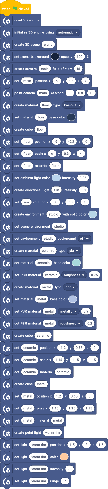
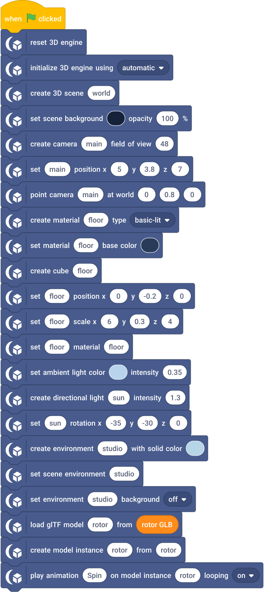
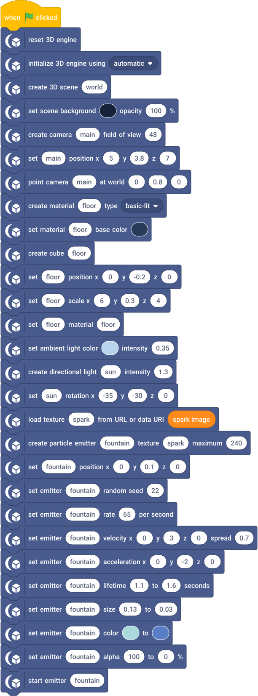
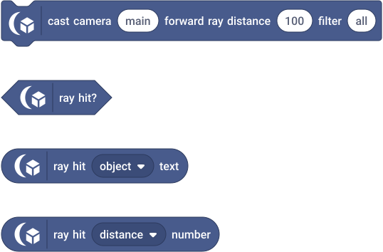
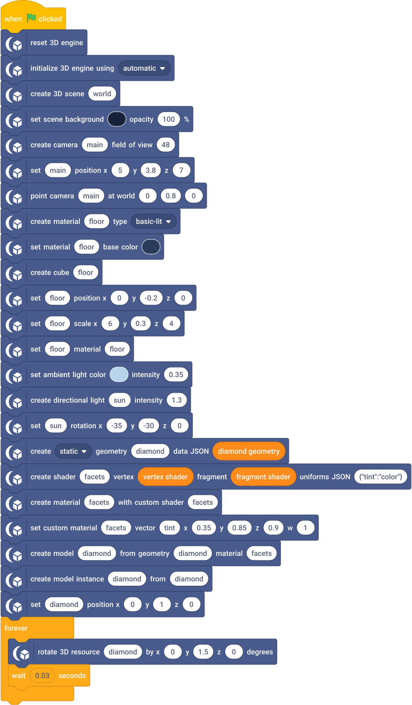

# Rendered workflows

These Scratch-style scripts show the setup and update loops in the runnable SB3 examples. They include initialization, reset and dependencies. Orange reporters hold embedded data in project variables. Inspect those variables to see the model/texture/GLSL source. The downloaded projects don't require network placeholders.

## Hello 3D

Create the engine, scene and camera before the cube. A static scene needs no repeated render command. [Open project and explanation](../examples/hello-3d/README.md).

## Materials and lighting

Create two PBR materials with distinct roughness/metallic factors, assign them to separate objects, then add environment and local light. [Open project](../examples/materials-lighting/README.md).

## Model loading and animation

The model-loading block pauses the script until the load finishes. Play the named Spin clip on the instance; clip time belongs to that instance. [Open project](../examples/animated-model/README.md).

## Particles

Load the texture, reserve a bounded emitter, configure velocity/lifetime/color, then start emission. [Open project](../examples/particles/README.md).

## Physics and audio

Use explicit collider dimensions, attach the dynamic body to the visible root, and load an embedded Scratch sound for a positional source. Playback requires running simulation and an accepted gesture. The loop resets the body every three seconds; the engine integrates physics between resets. [Open project](../examples/physics-audio/README.md).

## Post processing and render targets

A second camera writes a named texture on command. The monitor uses that texture while the main view applies restrained vignette/color/FXAA. Extra target views add render work without extra simulation. [Open project](../examples/post-processing/README.md).

## Raycasting

After creating the Hello 3D scene, cast one forward ray and inspect its stable results. The command block casts the ray; the three result reporters below read the same hit. Check the Boolean before using object/distance. Reporters do not recast.

For mouse picking, replace the forward cast with the logical-stage ray block and pass Scratch mouse X/Y. Read position/normal fields to place a marker only after a successful hit. Skinned hits can be bounds precision; consult the precision text field before treating a hit as an exact surface.

## Custom rendering

Geometry and shader source are project data. Create the material and model, then instantiate normally. The tint uniform updates values without changing program identity. Read [contract v1](../CUSTOM_RENDERING.md) before extending the shader. [Open project](../examples/custom-rendering/README.md).

