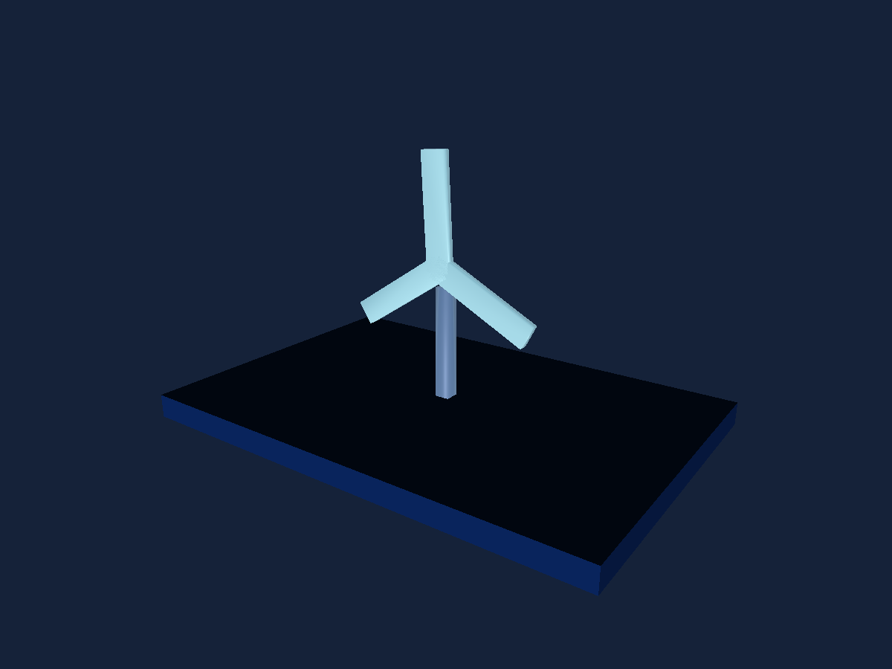

# Animated Model

Load an embedded original glTF rotor and play its named Spin clip.

## Run

1. Open [animated-model.sb3](animated-model.sb3) in TurboWarp Desktop or the TurboWarp web editor.
2. Approve the embedded custom extension when prompted. It is the self-contained Eclipse 3D build; the compatibility ID is `turbo3d`.
3. Click Green Flag. Stop All preserves the image and freezes simulation. Click Green Flag again to reset the example.

The project embeds its extension and assets. No development server or benchmark harness is required. A host may require explicit approval for unsandboxed data-URL extensions. See [loading instructions](../../docs/getting-started.md).

## Observe and change

A three-blade cyan rotor turning above an indigo stand. Pause/Stop freeze the clip; Green Flag rebuilds one clean scene.

The rotor asset is stored in a project variable. Its load block yields before instance creation. Pause/resume the clip or set its speed. This compact example demonstrates node TRS animation; skeletal skinning is also supported by the engine.

## Script

The script visual shows the project's blocks. Orange data reporters refer to embedded project variables; they are not placeholders for network downloads.

[All examples](../index.md) · [Block reference](../../docs/reference/index.md)
