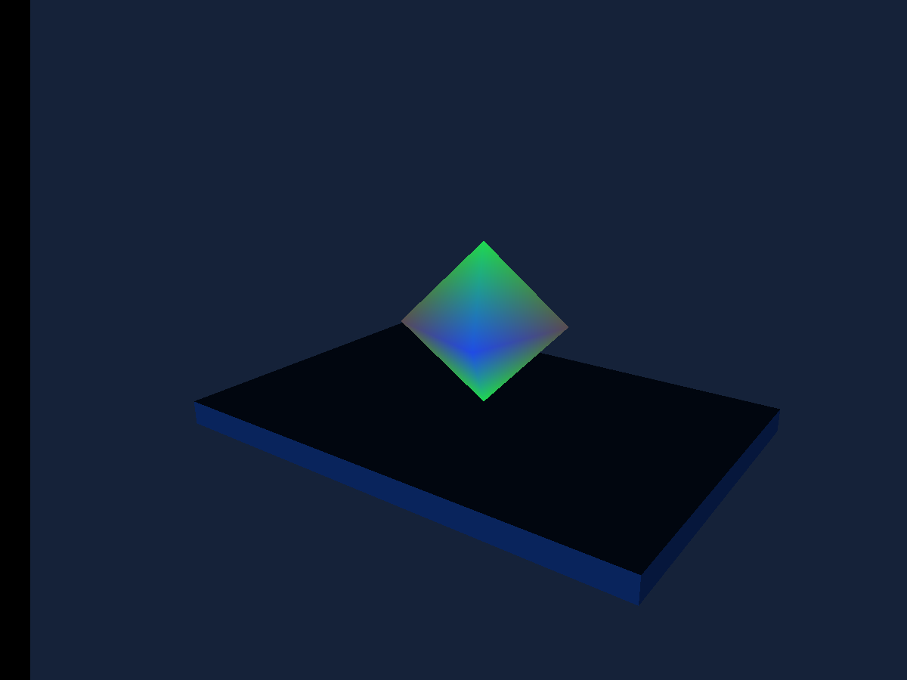

# Custom Rendering

Original octahedron geometry with a project-defined unlit GLSL material and typed tint uniform.

## Run

1. Open [custom-rendering.sb3](custom-rendering.sb3) in TurboWarp Desktop or the TurboWarp web editor.
2. Approve the embedded custom extension when prompted. It is the self-contained Eclipse 3D build; the compatibility ID is `turbo3d`.
3. Click Green Flag. Stop All preserves the image and freezes simulation. Click Green Flag again to reset the example.

The project embeds its extension and assets. No development server or benchmark harness is required. A host may require explicit approval for unsandboxed data-URL extensions. See [loading instructions](../../docs/getting-started.md).

## Observe and change

A rotating cyan faceted diamond on the studio plinth. The custom shader shades from its normals and tint rather than the scene light system.

Inspect the geometry and shader variables. Change tint with the typed uniform block. Shader source/schema determine program identity; changing uniform values does not compile a new shader. Contract v1 is unlit/unskinned and has no engine shadow hooks.

## Script

The script visual and SB3 are generated from the same maintained example definition. Orange data reporters refer to embedded project variables; they are not placeholders for network downloads.

[All examples](../index.md) · [Block reference](../../docs/reference/index.md) · [Source definitions](../../scripts/examples/projects.mjs)
