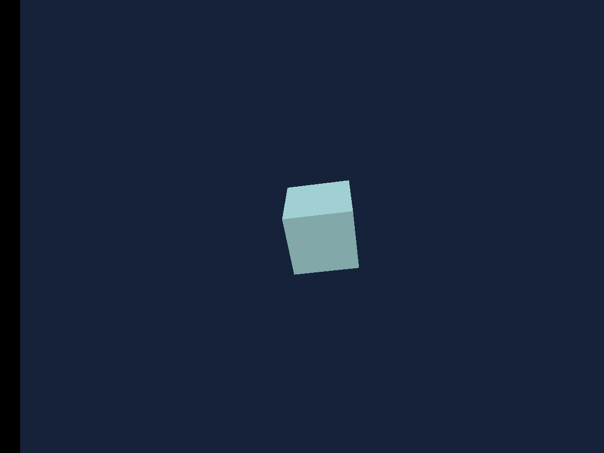

# Hello 3D

A first retained scene: one camera, one cube and two light inputs.

## Run

1. Open [hello-3d.sb3](hello-3d.sb3) in TurboWarp Desktop or the TurboWarp web editor.
2. Approve the embedded custom extension when prompted. It is the self-contained Eclipse 3D build; the compatibility ID is `turbo3d`.
3. Click Green Flag. Stop All preserves the image and freezes simulation. Click Green Flag again to reset the example.

The project embeds its extension and assets. No development server or benchmark harness is required. A host may require explicit approval for unsandboxed data-URL extensions. See [loading instructions](../../docs/getting-started.md).

## Observe and change

One pale cyan cube on an indigo background. Stop All keeps the last image.

Move main to change the view. Change the cube rotation or color once and observe the retained image. No forever render loop is needed.

## Script

The script visual and SB3 are generated from the same maintained example definition. Orange data reporters refer to embedded project variables; they are not placeholders for network downloads.

[All examples](../index.md) · [Block reference](../../docs/reference/index.md) · [Source definitions](../../scripts/examples/projects.mjs)
