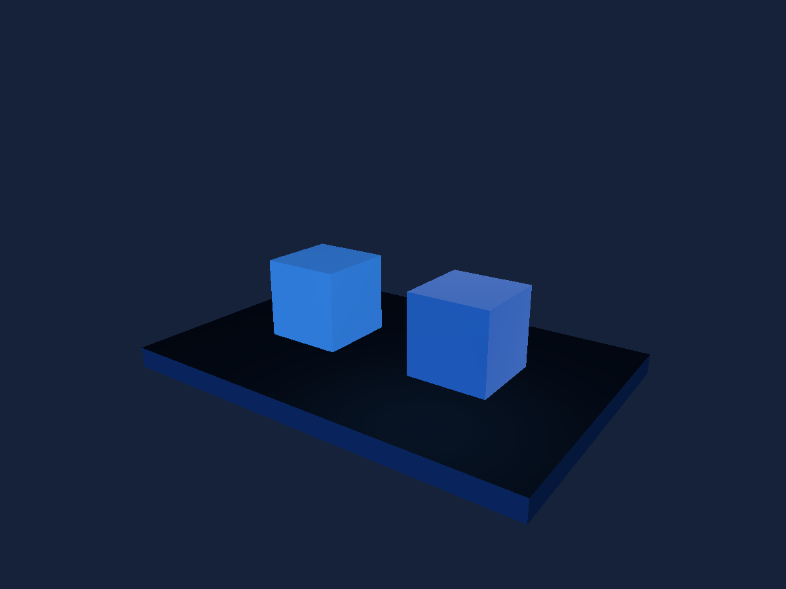

# Materials & Lighting

Compare rough ceramic with a metallic surface under shared studio light.

## Run

1. Open [materials-lighting.sb3](materials-lighting.sb3) in TurboWarp Desktop or the TurboWarp web editor.
2. Approve the embedded custom extension when prompted. It is the self-contained Eclipse 3D build; the compatibility ID is `turbo3d`.
3. Click Green Flag. Stop All preserves the image and freezes simulation. Click Green Flag again to reset the example.

The project embeds its extension and assets. No development server or benchmark harness is required. A host may require explicit approval for unsandboxed data-URL extensions. See [loading instructions](../../docs/getting-started.md).

## Observe and change

Two cubes on a dark plinth, with distinct PBR factors and a warm local rim. A solid environment provides uniform ambient IBL rather than a detailed reflection map.

Change metal roughness from 0.2 toward 1, then adjust the warm rim light. Material names are shared assets; the two objects use separate materials.

## Script

The script visual shows the project's blocks. Orange data reporters refer to embedded project variables; they are not placeholders for network downloads.

[All examples](../index.md) · [Block reference](../../docs/reference/index.md)
