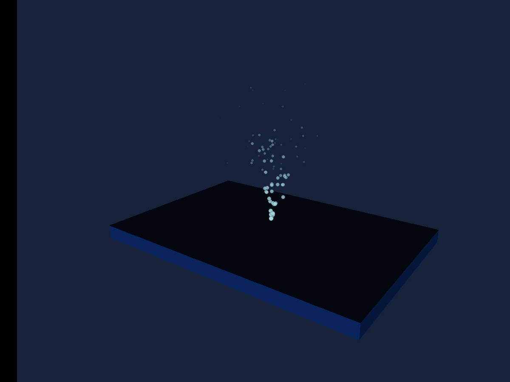

# Particles

A seeded fountain with bounded capacity, gravity and color/alpha over life.

## Run

1. Open [particles.sb3](particles.sb3) in TurboWarp Desktop or the TurboWarp web editor.
2. Approve the embedded custom extension when prompted. It is the self-contained Eclipse 3D build; the compatibility ID is `turbo3d`.
3. Click Green Flag. Stop All preserves the image and freezes simulation. Click Green Flag again to reset the example.

The project embeds its extension and assets. No development server or benchmark harness is required. A host may require explicit approval for unsandboxed data-URL extensions. See [loading instructions](../../docs/getting-started.md).

## Observe and change

A compact cyan-blue fountain above the plinth, fading as particles age. The seed repeats random choices; exact frame contents depend on elapsed simulation time.

Change emission rate, velocity spread and lifetime independently. Stopping the emitter allows existing particles to expire; pausing freezes them. The maximum is 240, not an unbounded spawn loop.

## Script

The script visual shows the project's blocks. Orange data reporters refer to embedded project variables; they are not placeholders for network downloads.

[All examples](../index.md) · [Block reference](../../docs/reference/index.md)
