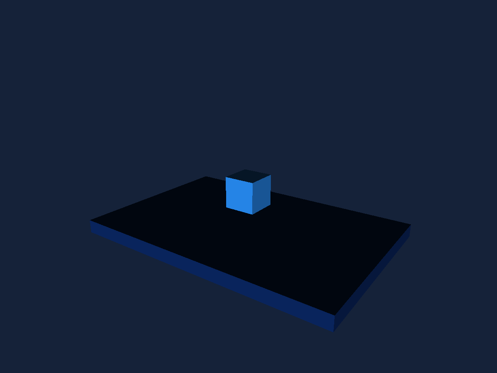
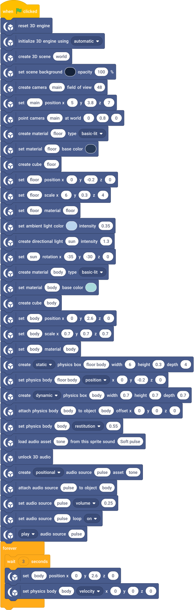

# Physics & Audio

An attached dynamic box falls onto a static floor while carrying a quiet positional pulse.

## Run

1. Open [physics-audio.sb3](physics-audio.sb3) in TurboWarp Desktop or the TurboWarp web editor.
2. Approve the embedded custom extension when prompted. It is the self-contained Eclipse 3D build; the compatibility ID is `turbo3d`.
3. Click Green Flag. Stop All preserves the image and freezes simulation. Click Green Flag again to reset the example.

The project embeds its extension and assets. No development server or benchmark harness is required. A host may require explicit approval for unsandboxed data-URL extensions. See [loading instructions](../../docs/getting-started.md).

## Observe and change

A cyan box dropping and bouncing above the plinth, with a soft repeating tone. Stop All holds physics and audio. Collision dimensions are explicit and independent of mesh scale.

Click Green Flag to authorize simulation/audio. The box resets every three seconds; gravity moves it between resets. Volume 0.25 is a factor. Move the camera to hear listener-relative attenuation. If blocked by autoplay, click the Stage to unlock and resume the pulse.

## Script

The script visual shows the project's blocks. Orange data reporters refer to embedded project variables; they are not placeholders for network downloads.

[All examples](../index.md) · [Block reference](../../docs/reference/index.md)
