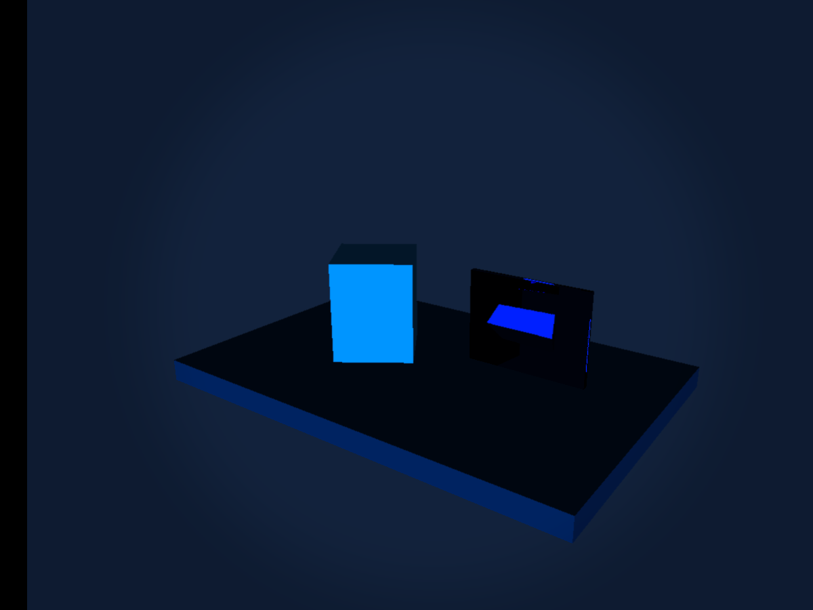
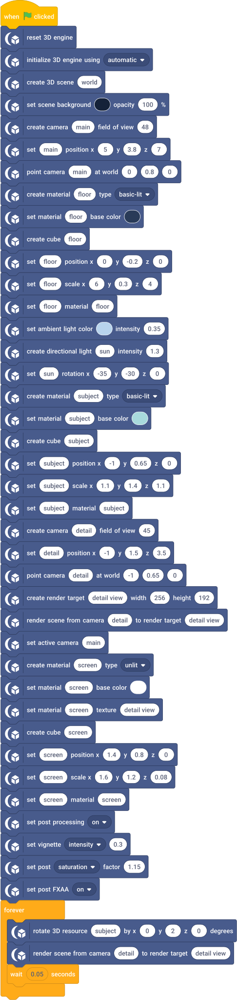

# Post Processing & Render Targets

A second camera updates an in-world monitor while the main view uses vignette, color and FXAA.

## Run

1. Open [post-processing.sb3](post-processing.sb3) in TurboWarp Desktop or the TurboWarp web editor.
2. Approve the embedded custom extension when prompted. It is the self-contained Eclipse 3D build; the compatibility ID is `turbo3d`.
3. Click Green Flag. Stop All preserves the image and freezes simulation. Click Green Flag again to reset the example.

The project embeds its extension and assets. No development server or benchmark harness is required. A host may require explicit approval for unsandboxed data-URL extensions. See [loading instructions](../../docs/getting-started.md).

## Observe and change

A turning cyan block at left and a thin monitor at right showing a closer camera view. The output uses restrained vignette and saturation; it does not claim HDR bloom.

The target updates only when its render command runs (20 requested updates/second here). Try removing that loop: the monitor keeps its last completed image. Disable post to compare the same geometry at neutral output.

## Script

The script visual shows the project's blocks. Orange data reporters refer to embedded project variables; they are not placeholders for network downloads.

[All examples](../index.md) · [Block reference](../../docs/reference/index.md)
